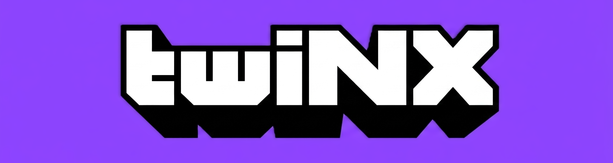

<p align="center">
  
</p>

<p align="center">
  <strong>A controller-first Twitch client for Nintendo Switch homebrew.</strong>
</p>

<p align="center">
  <a href="https://github.com/DomazinUS/twiNX/releases/latest"></a>
  
  
</p>

<p align="center">
  Created by <strong>HiroshiYamauchi</strong>
</p>

## About

**twiNX** is an independent Twitch client built specifically for Nintendo
Switch homebrew. Its interface is designed around Joy-Con and Pro Controller
navigation in both handheld and TV play.

The project began as a native Twitch playback proof of concept and now includes
account sign-in, browsing, channel pages, live streams, VODs, clips, chat,
badges, emotes and flexible player layouts.

## Features

### Browse Twitch

- Built-in Twitch account sign-in
- Followed live channels and a separate offline-followed row
- Popular streams, top categories and search
- Controller-friendly horizontal rows with pagination
- Channel artwork, stream thumbnails and account information

### Channel pages

- Live/offline status, banner, profile artwork and description
- Current stream and category information
- Recent broadcasts and clips
- Direct live, VOD and clip playback

### Playback

- Native Twitch live-stream, VOD and clip playback
- Source and transcoded quality selection
- Software decoding
- Experimental hardware decoding
- Experimental Hybrid decoding with software fallback
- Commercial-break and playlist-transition recovery
- Fullscreen, docked-chat and overlay-chat layouts

### Live chat

- Read and send Twitch chat messages
- Twitch username colors and native badges
- Global, channel, subscriber and exclusive emotes
- Message composer with Recent, Channel and All emote tabs
- Multi-line message wrapping
- Docked chat, full-height overlay and compact overlay
- Four-corner overlay placement and configurable width

### Controller-first interface

- D-pad and left-stick focus navigation
- Right-stick scrolling on long pages
- Handheld and television-friendly layouts
- Dedicated About page with features, credits and release history

## Installation

1. Download the latest release from the
   [twiNX Releases page](https://github.com/DomazinUS/twiNX/releases/latest).
2. Extract the release so the SD card contains:

   ```text
   /switch/twiNX/twiNX.nro
   ```

3. Launch twiNX from the Nintendo Switch Homebrew Menu.
4. Complete the built-in Twitch sign-in process.

No legacy `twinx.txt` configuration file is required.

## Updating

Replace the existing NRO in `/switch/twiNX/` with the newer release. Saved
authentication and application preferences are stored separately from the
executable.

## Decoder modes

- **Software:** recommended for maximum compatibility.
- **Hardware — Experimental:** lower CPU usage where supported, but Twitch
  presentation changes can require decoder recovery.
- **Hybrid — Experimental:** begins in hardware mode, can fall back to software
  during unstable transitions and may restore hardware decoding afterward.

## Known limitations

- Animated Twitch emotes are experimental and may remain on a static frame.
- Some standard Unicode emoji characters may render as missing-glyph boxes.
- Hardware and Hybrid behavior can vary by stream and selected quality.
- Twitch may change undocumented playback behavior without notice.

## Building from source

See [BUILDING.md](BUILDING.md) for the Nintendo Switch toolchain, the exact
FFmpeg/libnx TLS recipe used by the 0.8.1 release, and build commands.

Quick build after dependencies are prepared:

```powershell
.\build-switch.ps1
```

The generated executable is:

```text
build_switch/TwiNX.nro
```

The historical build-target filename retains `TwiNX`; the visible application
name is **twiNX**.

## Project history

Major milestones:

- `0.1.0` — Initial native Twitch playback proof of concept
- `0.2.0` — Twitch sign-in and content browsing
- `0.3.0` — Channel details and quality selection
- `0.4.0` — Read-only live chat
- `0.4.2` — TV-style docked chat
- `0.4.8` — Decoder mode selector
- `0.5.0` — Expanded chat, badges and emotes
- `0.6.0` — Chat composer and emote picker
- `0.7.0` — Channel pages
- `0.7.1` — VOD and clip playback
- `0.7.2` — Experimental Hybrid decoder
- `0.7.9` — Compact four-corner overlay chat
- `0.8.0` — Offline followed channels
- `0.8.1` — Correct branding, About page and complete in-app history

See [CHANGELOG.md](CHANGELOG.md) for the full release history.

## Credits

- **HiroshiYamauchi** — twiNX creator and developer
- **Switchfin contributors** — original Nintendo Switch UI/player/platform base
- **Borealis contributors** — controller-first UI framework
- **Twire contributors** — reference behavior for Twitch playback resolution
- **mpv, FFmpeg, libcurl, LunaSVG, libnx and devkitPro contributors**

Full attribution is available in
[THIRD_PARTY_NOTICES.md](THIRD_PARTY_NOTICES.md).

## License

The combined twiNX project and its original twiNX-specific code are distributed
under **GPL-3.0-only**. Inherited and third-party files retain their original
licenses and copyright notices. See [LICENSE](LICENSE),
[LICENSES](LICENSES/) and [THIRD_PARTY_NOTICES.md](THIRD_PARTY_NOTICES.md).

## Disclaimer

twiNX is an independent, unofficial homebrew project. It is not affiliated
with, endorsed by or sponsored by Twitch, Amazon or Nintendo. Product names and
trademarks belong to their respective owners.
